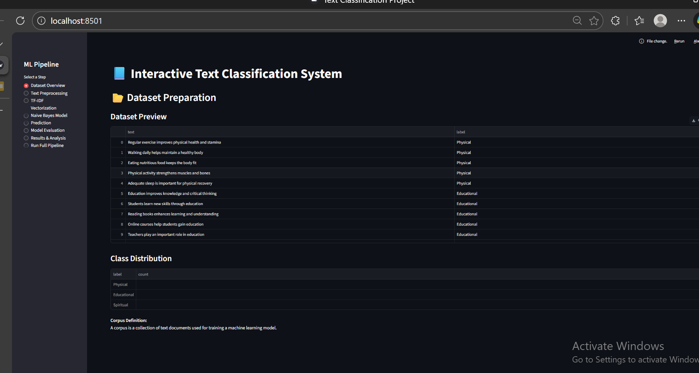
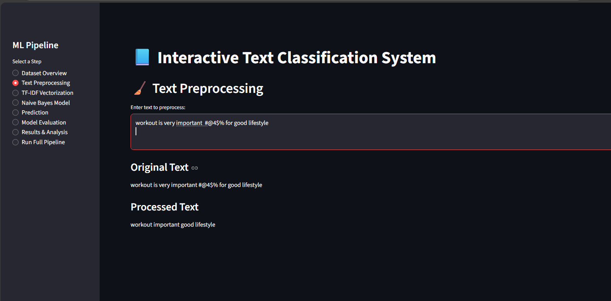
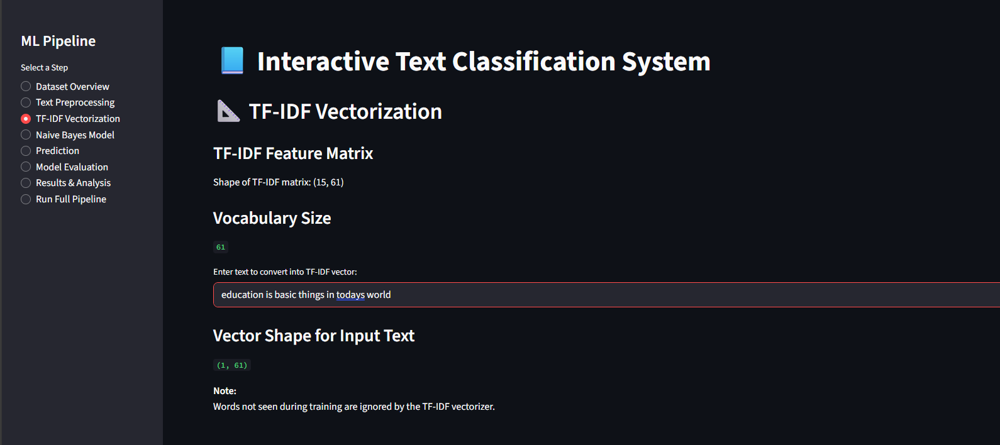
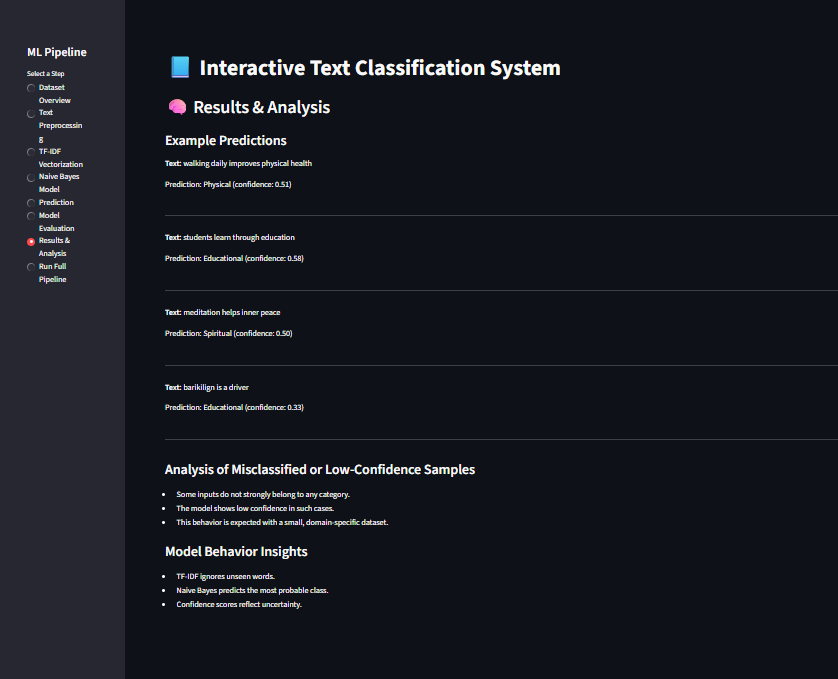
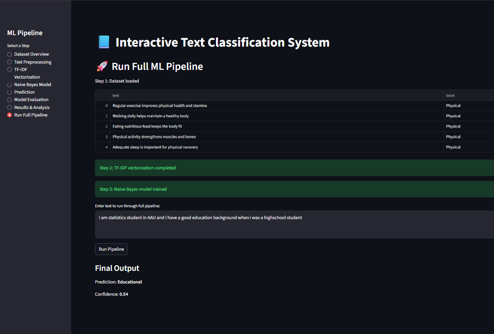

# Interactive Text Classification System  
### TF-IDF Vectorization with Multinomial Naive Bayes (Streamlit)

## 📌 Project Overview
        This project implements an interactive text classification system using 
        TF-IDF feature extraction and a Multinomial Naive Bayes classifier.

The system classifies text into three categories:
      - Physical
      - Educational
      - Spiritual

A Streamlit interface is used to demonstrate each step of the machine learning pipeline.


## 🎯 Objectives
          - Prepare a labeled text dataset
          - Perform text preprocessing and normalization
          - Extract features using TF-IDF
          - Train a Multinomial Naive Bayes classifier
          - Predict categories for unseen text
          - Evaluate model performance
          - Present results and analysis interactively


## 🧠 Machine Learning Pipeline
         The project follows a structured ML workflow:

             1. Dataset Preparation  
             2. Text Preprocessing  
             3. TF-IDF Vectorization  
             4. Model Training (Naive Bayes)  
             5. Prediction with Confidence Scores  
             6. Model Evaluation  
             7. Results & Analysis  
             8. Full Pipeline Execution

         Each step is implemented and visualized separately in Streamlit.


## 🖥️ Streamlit Application Steps

### 1️⃣ Dataset Overview
          - Displays the custom labeled dataset
          - Shows class distribution
          - Explains the concept of a text corpus

📸 *Screenshot:*  
          

---

### 2️⃣ Text Preprocessing
      - Demonstrates text cleaning and normalization
      - Shows before and after preprocessing results

📸 *Screenshot:*  
         


### 3️⃣ TF-IDF Vectorization
- Converts text into numerical vectors
- Displays feature matrix shape and vocabulary size
- Demonstrates handling of unseen words

📸 *Screenshot:*  
          

---

### 4️⃣ Naive Bayes Model Training
- Trains a Multinomial Naive Bayes classifier
- Displays trained class labels

📸 *Screenshot:*  
         

---

### 5️⃣ Prediction
- Allows users to input new text
- Predicts category with confidence scores
- Handles uncertain or unrelated inputs

📸 *Screenshot:*  
          

---

### 6️⃣ Model Evaluation
        - Accuracy
        - Precision, Recall, F1-score
        - Confusion Matrix

📸 *Screenshot:*  
         

---

### 7️⃣ Results & Analysis
          - Shows example predictions
          - Explains low-confidence and misclassified cases
          - Discusses model behavior and limitations

📸 *Screenshot:*  
          

---

### 8️⃣ Run Full Pipeline
          - Executes the complete ML pipeline in one click
          - Demonstrates end-to-end system functionality

📸 *Screenshot:*  
           

---

## 🧪 Technologies Used
          - Python
          - Streamlit
          - Pandas
          - NumPy
          - Scikit-learn

---

## ⚠️ Limitations
          - Small, manually created dataset
          - Evaluation performed on training data
          - TF-IDF does not capture semantic similarity between words

     These limitations are acknowledged as part of the learning objective.

---

## ▶️ How to Run the Project

       ```bash
             pip install -r requirements.txt
             streamlit run app.py


🙌 Credits

       Built by Barkilign Mulatu ( AGI intern at iCog Labs )
       Guided & Optimized with AI assistance.